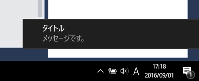

ToastForWin10.exe
====
Windows10のアクションセンターにメッセージを表示するだけのプログラム

Windows.winmdの参照の設定方法メモ
----
(1) csprojファイルに<TargetPlatformVersion>設定を追加する

   この設定はVisualStudioからはできないので要注意。
   タグ<PropertyGroup>の中に <TargetPlatformVersion>8.0</TargetPlatformVersion> を追加する
   csprojファイル編集後にVisualStudioでプロジェクトファイルを開く

(2) Windows.winmdの追加

   Visual Studioのメニュー"Poject"→"Add Reference..."を開き、
   左タブのWindows→Coreの中に"Windows"という名前で
   Windows.winmdが表示されているので、チェックを入れて参照に追加する。

(3) System.Runtime.WindowsRuntime.dllの追加

   左側タブのReferenceを選択後、ダイアログ右下の"Browse..."ボタンを押す。
   次のファイルを直接選択し、参照へ追加する。
   C:\Program Files(x86)\Reference Assemblies\Microsoft\Framework\.NETCore\v4.5\System.Runtime.WindowsRuntime.dll

GitHub
----
https://github.com/yoggy/ToastForWin10

Copyright and license
----
Copyright (c) 2016 yoggy

Released under the [MIT license](LICENSE.txt)
